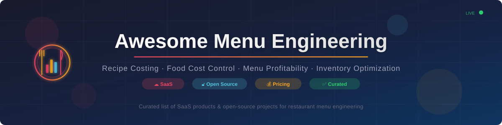

  

  
  
  
  
  
  

# 🍽️ Awesome Menu Engineering

## 🏆 Top Menu Engineering Platforms Ecosystem

**Curated List of SaaS Products & Open-Source GitHub Projects**  
*Focused on 📊 Recipe Costing, 💰 Food Cost Control, 📈 Menu Profitability Analysis, 📦 Inventory & 🏪 Restaurant Margin Optimization*  
**Last updated: August 2026**

This repository tracks notable **SaaS platforms** and **open-source projects** for **Menu Engineering**. These tools help restaurants and foodservice operators analyze recipe costs, track theoretical vs. actual food cost, optimize menu mix and pricing, manage inventory and purchasing, and improve overall contribution margins.

🔥 **Examples** include Restaurant365, Owner.com, CrunchTime, Olo (Omnivore), Popmenu, MarginEdge, MarketMan, Apicbase, Tenzo, MenuDrive — the category leaders in restaurant technology.

🔓 **Open-source emphasis**: This section is heavily expanded with every major active project for recipe costing, inventory management, food cost tracking, menu profitability analysis, and related open tools — ideal for independent operators, multi-unit groups, and developers seeking transparent or self-hosted alternatives to commercial menu engineering platforms.

🤝 Contributions welcome! Open a PR to add/update entries. Keep descriptions factual and link to official sites.

---

## 📑 Table of Contents
- [☁️ SaaS/Hosted Platforms](#%EF%B8%8F-saashosted-platforms)
- [🔓 Open-Source GitHub Projects](#-open-source-github-projects)
- [🤝 How to Contribute](#-how-to-contribute)
- [⚠️ Disclaimer](#%EF%B8%8F-disclaimer)
- [⭐ Star History](#-star-history)

---

## ☁️ SaaS/Hosted Platforms

> 💡 Sorted by company size (valuation/revenue) in descending order. Pricing and free tier details are researched from official sites, Capterra, G2, GetApp, and industry review sources.

| Platform | Description | Pricing (Starting Tier) | Free Tier / Free Trial Limits | Company Size |
|----------|-------------|------------------------|-------------------------------|-------------|
| **[Olo / Omnivore](https://omnivore.io/)** | Restaurant technology integration and data platform (acquired by Olo Inc., taken private by Thoma Bravo) that connects POS systems and enables broader operational analytics via API middleware. | ~$30/mo per connected location (pass-through venue fee); Enterprise/merchant contracts quote-based. Professional services: ~$90/hr (onboarding), ~$250/hr (custom integration dev). | Free developer sandbox account (unlimited testing, non-production; no live POS transactions). 30-day free trial for developer partners (full API access); requires commercial agreement for production launch | 💰 $2.0B valuation; $285M revenue (FY2024) |
| **[Restaurant365](https://www.restaurant365.com/)** | Comprehensive restaurant operations platform covering accounting, inventory, recipe management, labor, and multi-unit financial reporting. | $499/mo per location (Essential: accounting + AP automation); $749/mo per location (Professional: + inventory, recipe costing, labor); Enterprise quote-based. Implementation fee: $3,000–$15,000+. | No free plan; no free trial (0 days) — free demo & consultation available; annual contracts standard | 💰 $1.0B+ valuation; ~$100–132M ARR |
| **[Owner.com](https://www.owner.com/)** | All-in-one restaurant growth platform focused on online ordering, marketing, and guest data, with menu and operational support features. | $249/mo per location (Flex Plan + 5% commission per order); $499/mo per location (Flat-Rate Plan, 0% commission); Enterprise/multi-location custom pricing. 5% guest-facing order support fee at checkout on all plans. Setup fee: up to $1,000 (sometimes waived). | No free plan; no free trial (0 days) — free live demo available upon request. Month-to-month billing, no long-term lock-in. | 💰 $1.0B valuation; $81M ARR (Jan 2025) |
| **[CrunchTime](https://www.crunchtime.com/)** | Enterprise restaurant management platform with strong inventory, recipe, purchasing, and operations capabilities for larger multi-unit operators. | Enterprise quote-based only; full-suite deployments start ~$5,000+/mo total (scales with location count & modules: Inventory/Forecasting, Ops Execution, Labor, LMS). Annual/multi-year contracts. | No free plan; no free trial (0 days) — free personalized demo & product tours available; designed for 10+ location chains | 💰 >$100M ARR; PE-backed (Battery Ventures) |
| **[MarginEdge](https://www.marginedge.com/)** | Invoice processing, purchasing, inventory, and recipe costing platform focused on accurate food cost variance and accounts payable automation. | $350/mo per location (Standard, month-to-month); $315/mo per location (annual billing, ~10% discount); $500/mo per location (+ Freepour bar bundle). Unlimited invoice processing included. | No free plan; no free trial (0 days) — free demo available upon request; custom enterprise pilot negotiable | 💰 ~$200–250M valuation; ~$25M ARR |
| **[Popmenu](https://www.popmenu.com/)** | Restaurant marketing and digital presence platform with menu management, online ordering, and guest engagement tools. | $179/mo per location (Starter, monthly); $159/mo (annual); $299/mo per location (Essentials); $499/mo per location (Premier with AI phone assistant). $1/order flat fee (0% commission). Setup fee: $500–$1,300+. | No free plan; no standard free trial for full platform. 7-day free trial available for standalone tools only (e.g., Digital Waitlist); limited features, no ordering/AI/POS integration. Free demo available. | 💰 ~$178M valuation; ~$59M ARR |
| **[MarketMan](https://www.marketman.com/)** | Inventory, purchasing, recipe costing, and supplier management solution designed for restaurants seeking tighter food cost control. | $199/mo per location (Starter: core inventory, 50 invoice scans/mo); $249/mo per location (Growth: unlimited scanning, recipe costing, COGS tracking); Enterprise quote-based. Setup fee: $500–$1,500. | No free plan; no free trial (0 days) — free 1-on-1 live demo available; 12-month contract commitment required | 💰 ~$100–150M valuation; ~$14M ARR |
| **[MenuDrive / Lavu](https://www.menudrive.com/)** | Digital menu and online ordering platform (owned by Lavu Inc.) that supports menu management and guest-facing presentation. | $149/mo per location (standalone monthly); ~$74–$89/mo per location (annual billing, $891/yr); free add-on with Lavu POS subscription ($99–$149/mo). 0% commission on orders; payment processing: 3% + $0.20/txn. Setup fee: $149–$199. | No standalone free plan; free add-on with active Lavu POS subscription. Free trial: 30–90 days promotional (full feature access, unlimited orders, no caps) — requires sales consultation to activate | 💰 ~$67M valuation (Lavu); ~$22M ARR |
| **[Tenzo](https://www.gotenzo.com/)** | Restaurant analytics and menu engineering platform that connects POS, inventory, and labor data to deliver real-time profitability insights and forecasting. | From $75/mo (single-site base); $175–$250/mo per location (multi-site standard with AI forecasting); Enterprise quote-based with volume discounts. Billed per location, not per user seat. | No free plan; no free trial (0 days) — free guided product demo/tour available upon request | 💰 ~$30–50M valuation; ~$3.5M ARR |
| **[Apicbase](https://apicbase.com/)** | Culinary operations platform focused on recipe management, food cost, inventory, and production planning for professional kitchens. | From $160/mo per location (single outlet, per SoftwareSuggest); ~€249/mo (~$270) per location (base plan per Capterra/GetApp); €799/mo (Food Traceability module). Annual billing default; +15% surcharge for monthly. | No free plan; no free trial (0 days) — free demo available; free web-based Food Cost Calculator tool on site (no signup required) | 💰 ~$20–40M valuation; ~$3–5M ARR |

---

## 🔓 Open-Source GitHub Projects

> 💡 Sorted by GitHub stars (descending). Click the star badge to view stargazers.

- **[Mealie](https://github.com/mealie-recipes/mealie)**   
  Self-hosted recipe management and meal planning platform with shopping lists, webhooks, API access, and multi-user support. Ideal for building recipe cost databases.

- **[grocy](https://github.com/grocy/grocy)**   
  Self-hosted groceries and household management with recipe cost tracking, stock management, meal planning, and chore tracking. PHP-based ERP-lite for food operations.

- **[Tandoor Recipes](https://github.com/TandoorRecipes/recipes)**   
  Self-hosted recipe manager with meal planning, shopping lists, nutrition info, cost tracking, and multi-user collaboration. Django-based.

- **[InvenTree](https://github.com/inventree/InvenTree)**   
  Open-source inventory management system with bill of materials (BOM) features, adaptable for recipe costing and food ingredient tracking.

- **[TastyIgniter](https://github.com/TastyIgniter/TastyIgniter)**   
  Open-source online ordering, table reservation, and restaurant management platform built on PHP/Laravel with extensions marketplace.

- **[KitchenOwl](https://github.com/TomBursch/kitchenowl)**   
  Self-hosted grocery list and recipe manager with household expense tracking, meal planning, and multi-user support.

- **[recipe-scrapers](https://github.com/hhursev/recipe-scrapers)**   
  Python library to scrape recipes from 400+ cooking websites — useful for building recipe cost databases and automated menu data ingestion.

- **[CookLang](https://github.com/cooklang/CookLang)**   
  Markup language for recipe management with a rich ecosystem of CLI tools, apps, and integrations for structured recipe data.

- **[PartKeepr](https://github.com/partkeepr/PartKeepr)**   
  Open-source inventory management system with stock tracking and BOM features, adaptable for kitchen and food inventory operations.

- **[Open Food Network](https://github.com/openfoodfoundation/openfoodnetwork)**   
  Open-source food enterprise management platform for local food systems, ordering, distribution, and food hub management.

- **[GrandNode](https://github.com/grandnode/grandnode2)**   
  Open-source e-commerce platform built on .NET with food service and restaurant capabilities, supporting menu and order management.

- **[OpenEats](https://github.com/OpenEats/OpenEats)**   
  Open-source recipe management web application built with Python/Django and React for organizing recipes, ingredients, and menu items.

- **[RecipeSage](https://github.com/julianpoy/RecipeSage)**   
  Collaborative, self-hosted recipe manager with meal planning, shopping lists, recipe scaling, and import/export capabilities.

- **[POS-Awesome](https://github.com/yrestom/POS-Awesome)**   
  ERPNext-based Point of Sale application for restaurants and retail with menu management, order processing, and reporting.

- **[floreantpos](https://github.com/nicholasgasior/floreantpos)**   
  Open-source restaurant POS system with table management, kitchen display, ticket management, and sales reporting. Java-based.

- **[Flavor-Pairing](https://github.com/lamthuyvo/flavor-pairing)**   
  Data-driven food pairing and flavor analysis tool using network graphs — useful for menu innovation and engineering new dishes.

- **[MERN Restaurant POS](https://github.com/amritmaurya1504/Restaurant_POS_System)**   
  Full-stack MERN (MongoDB, Express, React, Node) restaurant POS application supporting table reservations, real-time order processing, and payment integrations.

- **[Restaurant-Management-System](https://github.com/AhmedHathworte/Restaurant-Management-System)**   
  Full restaurant management system with POS, inventory tracking, order management, and financial reporting.

- **[URY POS](https://github.com/ury-erp/pos)**   
  Web-based order and kitchen management system built as part of an open-source ERP designed specifically for food service operations.

- **[SurrealDB Restaurant POS](https://github.com/ahmedali5530/restaurant-pos)**   
  Open-source restaurant POS built with React and SurrealDB featuring inventory management, waste tracking, and automatic ingredient stock deduction per recipe.

- **[Rystro](https://github.com/ishtiuk/rystro)**   
  Open-source all-in-one restaurant management system covering POS, inventory, digital menus, analytics, and operational workflows.

- **[roux](https://github.com/Xaque8787/roux)**   
  Open-source web application for food and labor cost tracking, inventory management, recipe catalog, batch production, and dish profitability analysis.

- **[stockControl](https://github.com/siwhelan/stockControl)**   
  Django-based system for catering and kitchen operations featuring stock control, recipe creation & costing, and gross profit guidance.

- **[Recipe Costing & Menu Engineering Application](https://github.com/GarvitTech/Recipe-Costing-Application)**   
  Desktop application for managing ingredients, creating recipes, calculating costs, performing menu engineering analysis, and generating professional reports.

- **[Digital Menu Projects](https://github.com/willdyess/digitalMenu)**   
  Open-source digital menu solutions that can be extended with costing and allergen data for operational use.

- **[PlateOps & Nutrition/Inventory APIs](https://github.com/Laelapa/PlateOps)**   
  API-focused projects for food stock management, recipe handling, and building custom nutrition or inventory applications.

- **[AI Restaurant Engine](https://github.com/zubair-trabzada/ai-restaurant-claude)**   
  AI-driven restaurant operations tool that performs menu engineering analysis using the Kasavana matrix (Stars, Plowhorses, Puzzles, Dogs).

- **[Chefs Office](https://github.com/JConradoN/chefs-office-showcase)**   
  Professional kitchen management concepts including AI-assisted recipe ingestion, cost analysis, and multi-establishment support.

### 💡 Additional Strong Open-Source Options

- 🏗️ **Full cost & inventory systems**: grocy, InvenTree, roux, and stockControl provide the most complete open-source foundations for food cost management.
- 🧮 **Recipe costing tools**: Mealie, Tandoor Recipes, RecipeSage, and CookLang offer dedicated recipe management with cost tracking capabilities.
- 🍕 **Restaurant operations suites**: POS-Awesome, floreantpos, and Rystro provide broader open-source POS + inventory projects that can be extended with costing modules.
- 📊 **Data & scraping tools**: recipe-scrapers and Flavor-Pairing enable automated data collection and menu innovation.
- 🛒 **Food supply chain**: Open Food Network provides end-to-end food distribution and ordering infrastructure.
- 🧑‍🍳 Community **kitchen management**, **recipe databases**, and **food cost** projects continue to appear on GitHub.

**Frameworks for building custom systems**: Combine open **recipe & ingredient databases** (Mealie, Tandoor), costing calculation engines, inventory tracking modules (InvenTree, grocy), and simple analytics dashboards (or spreadsheet exports) to create a practical self-hosted menu engineering and food cost control system.

---

## 🤝 How to Contribute

1. 🍴 Fork the repo.
2. ✏️ Add/edit entries in `README.md` (follow existing format).
3. 📝 Include: name, link, 1–2 sentence description, and whether it's SaaS or open-source.
4. 🚀 Submit PR with a short explanation.

⭐ Star the repo if you find it useful!

---

## ⚠️ Disclaimer

- This is a **community-curated** list — not exhaustive and not an endorsement.
- Menu engineering and food cost systems handle operational and financial data; accurate inputs (recipes, yields, invoices) are essential for reliable outputs.
- Self-hosted open-source solutions require ongoing data maintenance, integration with POS/purchasing systems, and validation against actual inventory counts.

---

**Made for restaurant operators, chefs, multi-unit managers, and hospitality technologists.** 🍽️  
Let's make menu engineering and food cost control more open, accurate, and accessible. 🚀

---

## ⭐ Star History

<a href="https://www.star-history.com/?repos=ishandutta2007%2FAwesome-Menu-Engineering&type=date&legend=bottom-right">
<picture>
<source media="(prefers-color-scheme: dark)" srcset="https://api.star-history.com/chart?repos=ishandutta2007/Awesome-Menu-Engineering&type=date&theme=dark&legend=bottom-right" />
<source media="(prefers-color-scheme: light)" srcset="https://api.star-history.com/chart?repos=ishandutta2007/Awesome-Menu-Engineering&type=date&legend=bottom-right" />

</picture>
</a>

